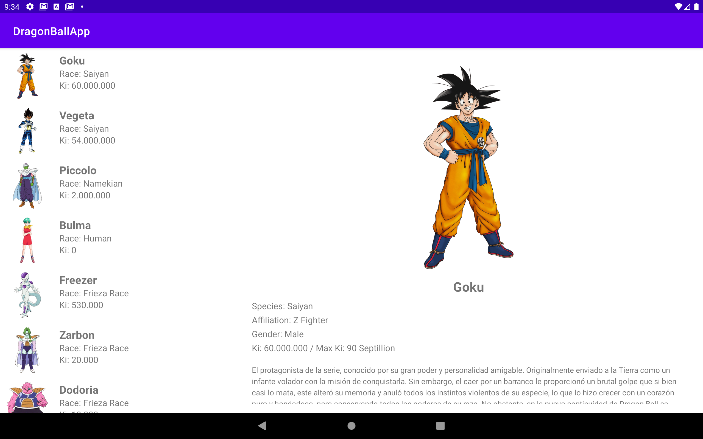
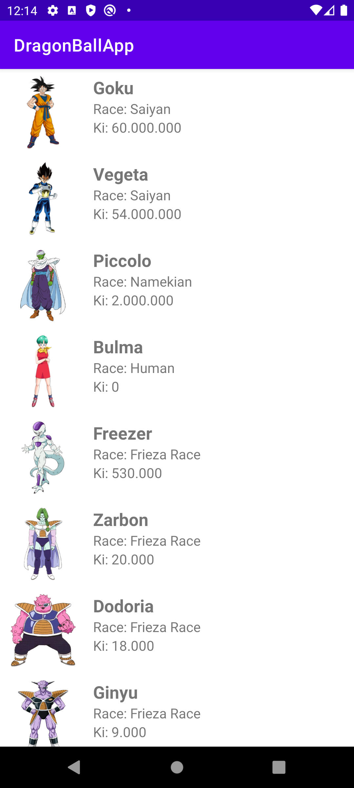
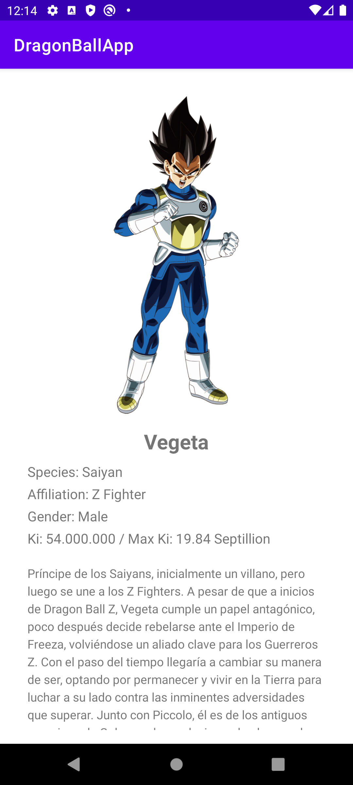
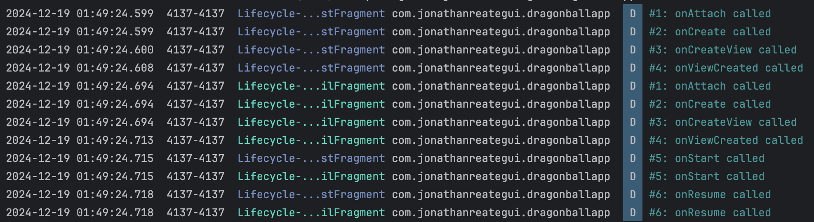

# DragonBallApp
### Interfaz de usuario adaptable con Fragments, LiveData y ViewModel.

<table>
  <tr>
    <td></td>
    <td></td>
  </tr>
</table>

## Descripción

Esta aplicación de Android muestra una lista de personajes de Dragon Ball junto con sus detalles, con diseños adaptables tanto para móviles como para tabletas. Diseñada con Fragments, la app garantiza una interfaz de usuario adaptable que se ajusta a pantallas de diferentes tamaños. Demuestra la integración de ViewModel y LiveData para la gestión del estado, RecyclerView para listas dinámicas y Glide para la carga de imágenes. La aplicación enfatiza la navegación responsiva y resalta los métodos del ciclo de vida de los Fragments con registros detallados para fines educativos.

## Características

- **Fragments**: Para asegurar un diseño adaptable tanto para móviles como para tabletas.
- **ViewModel and LiveData**: Para una moderna gestión de estado gestión.
- **RecyclerView**: Para mostrar un lista dinámico y desplazable.
- **Glide**: Para la carga imágenes de imagenes desde URLs.
- **Kotlin with XML**: Para crear los diseños de la interfaz.
- **Intent**: Para la navegación entre actividades.

## Configuraciones necesarias

- No se requiere configuración adicional.

## Eventos del Ciclo de Vida de un Fragment y Ejemplos

<table>
  <tr>
    <td><strong>Evento</strong></td>
    <td><strong>Descripción</strong></td>
    <td><strong>Casos de Uso Comunes</strong></td>
  </tr>
  <tr>
    <td>onAttach()</td>
    <td>El fragment se asocia con una actividad.</td>
    <td>Inicializar recursos relacionados con el contexto o callbacks.</td>
  </tr>
  <tr>
    <td>onCreate()</td>
    <td>El fragment es creado (similar al onCreate de una actividad).</td>
    <td>Inicializar componentes no relacionados con la UI como ViewModel o fuentes de datos.</td>
  </tr>
  <tr>
    <td>onCreateView()</td>
    <td>Se crea el diseño de la UI para el fragment.</td>
    <td>Inflar el diseño del fragment e inicializar componentes de la UI.</td>
  </tr>
  <tr>
    <td>onViewCreated()</td>
    <td>La jerarquía de vistas del fragment está completamente creada.</td>
    <td>Vincular datos a los componentes de la UI y configurar observadores o listeners.</td>
  </tr>
  <tr>
    <td>onViewStateRestored()</td>
    <td>Se llama después de que la vista del fragmento ha sido creada y el estado ha sido restaurado.</td>
    <td>Restaura el estado de la interfaz de usuario, como la posición de desplazamiento o los campos de entrada.</td>
  </tr>
  <tr>
    <td>onStart()</td>
    <td>El fragment se vuelve visible para el usuario.</td>
    <td>Iniciar animaciones o refrescar componentes de la UI.</td>
  </tr>
  <tr>
    <td>onResume()</td>
    <td>El fragment está en primer plano y el usuario puede interactuar con él.</td>
    <td>Reanudar actualizaciones de la UI o iniciar operaciones intensivas como la reproducción de medios.</td>
  </tr>
  <tr>
    <td>onPause()</td>
    <td>El fragment ya no está en primer plano.</td>
    <td>Pausar tareas en curso como la reproducción de medios o animaciones.</td>
  </tr>
  <tr>
    <td>onStop()</td>
    <td>El fragment ya no es visible para el usuario.</td>
    <td>Liberar recursos o guardar estados temporales.</td>
  </tr>
  <tr>
    <td>onDestroyView()</td>
    <td>Se destruye la jerarquía de vistas asociada al fragment.</td>
    <td>Limpiar recursos relacionados con las vistas para evitar fugas de memoria.</td>
  </tr>
  <tr>
    <td>onDestroy()</td>
    <td>El fragment es completamente destruido.</td>
    <td>Liberar cualquier recurso restante o finalizar operaciones.</td>
  </tr>
  <tr>
    <td>onDetach()</td>
    <td>El fragment se desasocia de su actividad anfitriona.</td>
    <td>Limpiar referencias a la actividad o al contexto.</td>
  </tr>
</table>

## Demostración

A continuación, algunas capturas de pantalla de la aplicación:

<table>
  <tr>
    <td colspan="2"></td>
  </tr>
  <tr>
    <td></td>
    <td></td>
  </tr>
  <tr>
    <td colspan="2"></td>
  </tr>
</table>

## License 

The MIT License (MIT)

- **Copyright (c) 2024 Jonathan Reátegui**

Permission is hereby granted, free of charge, to any person obtaining a copy of this software and associated documentation files (the "Software"), to deal in the Software without restriction, including without limitation the rights to use, copy, modify, merge, publish, distribute, sublicense, and/or sell copies of the Software, and to permit persons to whom the Software is furnished to do so, subject to the following conditions:

The above copyright notice and this permission notice shall be included in all copies or substantial portions of the Software.

THE SOFTWARE IS PROVIDED "AS IS", WITHOUT WARRANTY OF ANY KIND, EXPRESS OR IMPLIED, INCLUDING BUT NOT LIMITED TO THE WARRANTIES OF MERCHANTABILITY, FITNESS FOR A PARTICULAR PURPOSE AND NONINFRINGEMENT. IN NO EVENT SHALL THE AUTHORS OR COPYRIGHT HOLDERS BE LIABLE FOR ANY CLAIM, DAMAGES OR OTHER LIABILITY, WHETHER IN AN ACTION OF CONTRACT, TORT OR OTHERWISE, ARISING FROM, OUT OF OR IN CONNECTION WITH THE SOFTWARE OR THE USE OR OTHER DEALINGS IN THE SOFTWARE.
