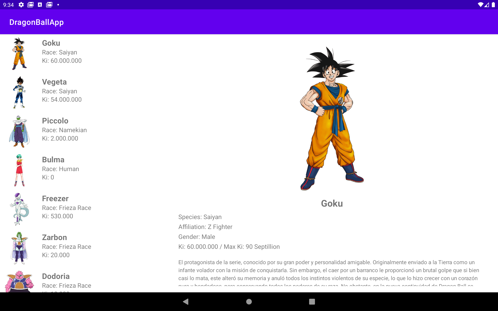
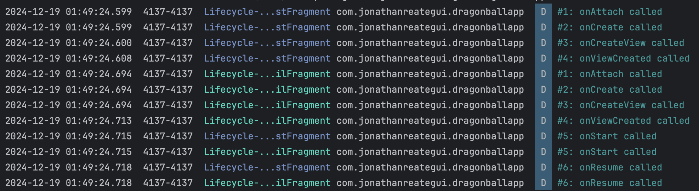

# DragonBallApp
### Adaptive UI with Fragments, LiveData, and ViewModel

<table>
  <tr>
    <td></td>
    <td></td>
  </tr>
</table>

## Description

This Android application showcases a list of Dragon Ball characters and their details with both mobile and tablet-friendly layouts. Designed with Fragments, the app ensures an adaptive UI that supports both mobile and tablet screen sizes. It demonstrates the integration of ViewModel and LiveData for state management, RecyclerView for dynamic lists, and Glide for image loading. The app emphasizes responsive navigation and highlights Fragment lifecycle methods with detailed logging for educational purposes.

## Features

- **Fragments**: To ensure an adaptive layout for both mobile and tablet.
- **ViewModel and LiveData**: To implement modern state management.
- **RecyclerView**: To display a dynamic and scrollable list.
- **Glide**: To loads and displays character images from URLs.
- **Kotlin with XML**: To create layouts
- **Intent**: To navigate between activities.

## Required Configuration

- No additional configuration is required.

## Fragment Lifecycle Events and Examples

<table>
  <tr>
    <td><strong>Event</strong></td>
    <td><strong>Description</strong></td>
    <td><strong>Common Use Cases</strong></td>
  </tr>
  <tr>
    <td>onAttach()</td>
    <td>The fragment is associated with an activity.</td>
    <td>Initialize context-related resources or callbacks.</td>
  </tr>
  <tr>
    <td>onCreate()</td>
    <td>The fragment is created (similar to an activity's onCreate).</td>
    <td>Initialize non-UI components such as ViewModel or data sources.</td>
  </tr>
  <tr>
    <td>onCreateView()</td>
    <td>The UI layout for the fragment is created.</td>
    <td>Inflate the fragment layout and initialize UI components.</td>
  </tr>
  <tr>
    <td>onViewCreated()</td>
    <td>The fragment's view hierarchy is completely created.</td>
    <td>Bind data to UI components and set up observers or listeners.</td>
  </tr>
  <tr>
    <td>onViewStateRestored()</td>
    <td>Called after the fragment's view has been created and state is restored.</td>
    <td>Restore UI state, such as scroll position or input fields.</td>
  </tr>
  <tr>
    <td>onStart()</td>
    <td>The fragment becomes visible to the user.</td>
    <td>Start animations or refresh UI components.</td>
  </tr>
  <tr>
    <td>onResume()</td>
    <td>The fragment is in the foreground and user can interact with it.</td>
    <td>Resume UI updates or start heavy operations like media playback.</td>
  </tr>
  <tr>
    <td>onPause()</td>
    <td>The fragment is no longer in the foreground.</td>
    <td>Pause ongoing tasks like media playback or animations.</td>
  </tr>
  <tr>
    <td>onStop()</td>
    <td>The fragment is no longer visible to the user.</td>
    <td>Release resources or save temporary states.</td>
  </tr>
  <tr>
    <td>onDestroyView()</td>
    <td>The view hierarchy associated with the fragment is destroyed.</td>
    <td>Clean up view-related resources to avoid memory leaks.</td>
  </tr>
  <tr>
    <td>onDestroy()</td>
    <td>The fragment is completely destroyed.</td>
    <td>Release any remaining resources or finalize operations.</td>
  </tr>
  <tr>
    <td>onDetach()</td>
    <td>The fragment is detached from its host activity.</td>
    <td>Clean up references to the activity or context.</td>
  </tr>
</table>

## Demo

Here are some screenshots of the application:

<table>
  <tr>
    <td colspan="2"></td>
  </tr>
  <tr>
    <td></td>
    <td></td>
  </tr>
  <tr>
    <td colspan="2"></td>
  </tr>
</table>

## License 

The MIT License (MIT)

- **Copyright (c) 2024 Jonathan Reátegui**

Permission is hereby granted, free of charge, to any person obtaining a copy of this software and associated documentation files (the "Software"), to deal in the Software without restriction, including without limitation the rights to use, copy, modify, merge, publish, distribute, sublicense, and/or sell copies of the Software, and to permit persons to whom the Software is furnished to do so, subject to the following conditions:

The above copyright notice and this permission notice shall be included in all copies or substantial portions of the Software.

THE SOFTWARE IS PROVIDED "AS IS", WITHOUT WARRANTY OF ANY KIND, EXPRESS OR IMPLIED, INCLUDING BUT NOT LIMITED TO THE WARRANTIES OF MERCHANTABILITY, FITNESS FOR A PARTICULAR PURPOSE AND NONINFRINGEMENT. IN NO EVENT SHALL THE AUTHORS OR COPYRIGHT HOLDERS BE LIABLE FOR ANY CLAIM, DAMAGES OR OTHER LIABILITY, WHETHER IN AN ACTION OF CONTRACT, TORT OR OTHERWISE, ARISING FROM, OUT OF OR IN CONNECTION WITH THE SOFTWARE OR THE USE OR OTHER DEALINGS IN THE SOFTWARE.

## Notes

- This README is also available in Spanish  [here](README-es.md)
- Este README también está disponible en español  [aquí](README-es.md)
